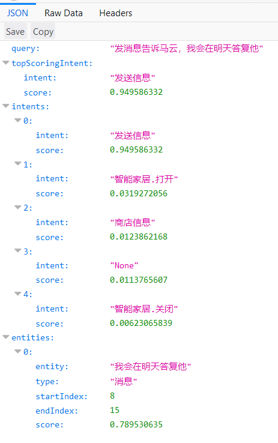

# luis意图识别 - 创建意图和实体

应用网址：<https://www.luis.ai/applications>

## 创建意图

点击 **Create new intent** 创建意图

输入意图的名字然后点击 **Done**

通过创建意图，你可以创建你需要定义的一类信息，分类名字可以让其他应用的使用者在查询意图时候找到一个合适的答案。LUIS不会回答这些问题，只定义什么信息可能会被问到。

## 添加表达

在输入框中输入一些这个意图可能发生的表达。比如

- 你们什么时候开门
- 你们几点上班
- 你们现在开着吗
- 你的电话号码是什么
- 有人可以给我打电话吗
- 你们的店在哪里
- 我怎么去你的商店

LUIS 现在没有表达给空意图，它需要一些表达，不想让app来回答，所以必须要有一些表达在空意图里，例如：

- 取消
- 再见
- 发生了啥

在你调用LUIS的程序中，可能是聊天机器人，如果LUIS为返回空意图，你的机器人就可以询问用户是否想要结束对话了。如果用户不想结束聊天的话。机器人同样可以给一些其他话题来继续聊天。

然后重新训练，测试。

可以看到准确的识别到了，我们的意图。

## 创建实体

根据官方教程，我们先创建一个新的意图，名字为 **发送信息**。

同上，我们为 发送信息 添加一些表达。比如：

- 我已收到您的信息，我会在明天答复您
- 发送信息你什么时候回家
- 短信我很忙
- 告诉他们事情今天必须做完
- 微信我在开车一会回复他
- 写信息告诉大卫说是什么时候
- 给格里戈说你好

向空意图中添加表达

应用现在还没有在空意图中添加任何表达，在空意图里的表达，LUIS将不会回复，所以不要让它为空。

## 创建简单实体

回到发送信息意图，在表达“我已收到您的信息，我会在明天答复您” 选择消息的第一个字我和最后一个字您，所有的字就会被选中，并弹出一个对话框。

在输入框中输入 **消息**

选择 **Create new entity**，将弹出对话框，默认的实体类型是 简单实体，实体名写成消息。然后点击 **Done**

现在实体已创建，而且有一个表达被标记。然后标记剩下的表达，选择想要标记的第一个字和最后一个字，然后弹出对话框，选择消息实体，消息就会被标记。

默认的显示方式是实体显示，选择关掉 **Entities View** 然后显示具体的小时内容。

### 训练发布

详情查看 [luis意图识别 - 基础](../luis意图识别 - 基础)

### 测试

通过测试面板，可以发现特定的表达还是能够准确识别的。

应用发布以后，可以在浏览器中测试，可以看到标注过的消息也是可以识别的。

## 创建列表实体

下面通过点饮料的表达，例如“要一杯咖啡和一杯牛奶”，返回数据饮料的类型，准确的从一列实体中找出与之匹配的。

列表实体是一些可供选择的商品的已知数据，饮品的名字可以包括俚语，缩略语，但是名字并不会很频繁的变化的。

列表实体是为了从表达中找出完全匹配的实体，列表实体可以包含字符或者短语。

一些表达的例子：

- 两杯牛奶
- 三瓶水
- 两杯可乐

缩略语：

- 2 牛奶
- 3 水
- 1 可乐

根据文档创建 **订购列表** 意图。

添加表达，例如：

- 请送两杯可乐和一瓶水到我的房间
- 两杯巴黎水配几片莱姆果
- 水

选择表达中的 水，创建实体

在弹出的对话框中选择列表实体，输入其他水的同义词

然后标记其他的饮品

## 从实体页修改列表实体

点击页面左侧 **Entities**，选择 **饮品**

在 Values 下面的输入框中，输入 **汽水**

然后在汽水后面输入同义词，例如

- 可乐
- 可口可乐
- 百事可乐
- 雪碧
- 七喜
- 芬达

同义词可以包括短语，标点符号，所有格和复数，列表实体会严格匹配，所以同义词需要所有可能的变量，你可以通过在学习中扩充这个列表，或者去查找用户反馈来扩充这个列表。

## 训练发布

详情请查看 [luis意图识别 - 基础](../luis意图识别 - 基础)

## 测试

在咖啡没有加入实体之前，还是能够识别到意图。

发布之后，在浏览器的测试中，识别出了饮品

## 创建等级实体

如果用户想要预定机票，应用将通过等级实体在用户的表达中决定位置，出发城市和到达城市。

等级实体对于实体中又两部分的数据特别有用。

- 两个位置，通常表示城市或者机场号
- 通常有唯一的来决定出发地和到达地，比如去，来自，离开等
- 两个地点经常出现在同一个表达中

等级实体是为了找到用户表达中相互关联的数据，看下面的例子：

>预定一张从西雅图到开罗的票

这个表达有两个特定的地方，一个是出发地，西雅图，还有一个是目的地，开罗。两个城市在订票过程中都很重要。虽然他们同样可以通过简单实体来发现，但是他们常常在同一个表达中联系在一起。因此，它们可以作为子实体，来组成一个位置的等级实体。

作为机器学习实体，应用需要标记了出发地和目的地的表达样例，这将教会LUIS实体在表达的什么地方，这个实体在哪儿，多长。

根据教程需要两个意图，**预定机票**和**None**，**None**我们现在已经有了，接着创建 **预定机票** 意图，创建详情同上。

## 等级实体是通过上下文得到的

实体的目的是从表达的文本中查找并分类，等级实体是基于上下文 父 ---> 子 实体。人们可以通过去往和来自来决定表达中的出发地和目的地。下面是一个上下文使用的例子。

对于旅行应用，LUIS提取目的地和出发地，然后填充预留的空。例如

- 预定一张下周一飞伦敦的机票
- 两张这周末从达拉斯到都柏林的机票
- 预定两张下星期一从西雅图飞开罗的票
- 预定一张明天飞伦敦的票
- 安排四张四月一号从巴黎飞伦敦的票

选择西雅图，输入**位置**，创建等级实体

在弹出的对话框中写入 **位置**， Hierarchical，创建出发地和目的地子实体。

现在实体已创建，我们还有一些表达需要标记，必须选择正确的出发地和目的地。

## 训练发布

详情请查看 [luis意图识别 - 基础](../luis意图识别 - 基础)

## 测试

## 创建正则表达式实体

实体的作用是从表达中获取一些重要的信息，应用使用正则表达式实体从表达中找出知识库(Knowledge Base) KB 文章号，它不是机器学习。

下面是一些简单的例子：

- KB123456什么时候发布？
- 谁发布的KB112211?
- KB224466在法国发布了吗？

缩略形式和俚语：

- KB123456
- kb123456 时间？
- kb123456 标题?

这个实体的正则表达式是 `kb[0-9]{6,}`

根据教程创建知识库意图

添加一些表达，例如：

- 请发送kb123456的PDF到mark@company.com
- 让KB121212的作者知道如何更新操作指南
- kb135135啥时候发布?

创建正则表达式实体

创建完成之后，知识库表达的实体将自动标注。

## 训练发布

详情请查看 [luis意图识别 - 基础](../luis意图识别 - 基础)

## 测试

## 关键词实体

### 关键词提取

下面是一些关键词的例子：

|表达|关键词|
|-|-|
|明年有没有新的医疗计划提供更低的折扣？| 更低的折扣，新的医疗计划，年|
|视觉疗法有没有覆盖高折扣医疗计划| 高折扣医疗计划，视觉疗法|

在对话中，决定接着怎么聊天时，除了所有其他已经被提取的实体，聊天机器人还可以考虑这些值。

## 情感分析

目前不支持中文
