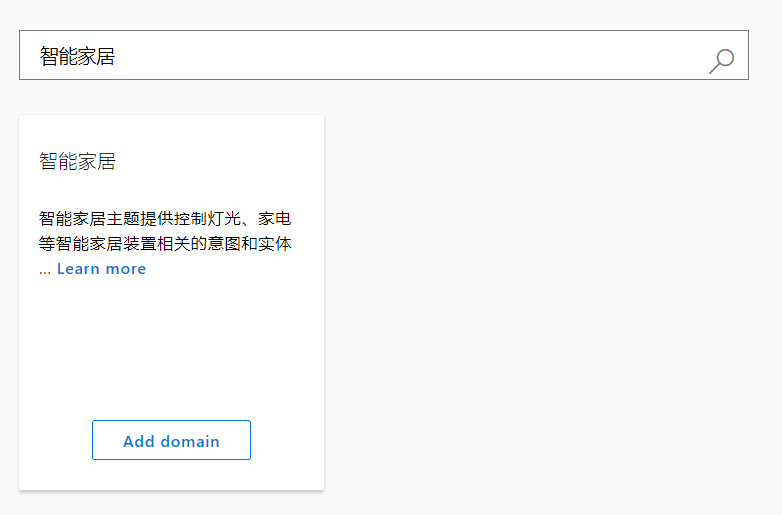

# luis意图识别 - 基础

应用网址：<https://www.luis.ai/applications>

LUIS 是 Language Understanding Intelligent Service 的首字母缩写，LUIS通过机器学习可以让开发者创建理解自然语言的应用，从自然语言中提取信息。

## 关键概念

**意图** 表示用户希望执行的动作，用户的输入表达的意愿或者目标。比如预定机票，支付账单，或者查找文章。你可以定义和某些动作相关的意图。比如，旅行应用可以定义一个意图：预定机票。

**表达** 是需要理解的用户输入的文本，可能是一句话，比如：帮我订一张去巴黎的机票，或者句子中的一些片段，比如 “预订” 或者 “巴黎的机票”。表达不总是格式化的，所以可能有很多不同的表达只想同一个特定的意图。

**实体** 表示与表达相关的详细信息。例如，“帮我订一张去巴黎的机票” 中，巴黎是一个位置，在用户的表达中，通过提示识别和标记实体，LUIS帮助你选择特定的动作来回复用户的需求。

| 意图 | 表达 | 实体 |
|-|-|-|
|机票预订|订一张去西雅图的机票|西雅图|
|商店营业时间和位置|你们什么时候开门？|开门
|会议安排|下午一点安排与某人的会议|下午一点， 某人

## 访问LUIS

LUIS 有两种方法来创建模型： [Authoring REST-based APIs](https://aka.ms/luis-authoring-api) 和 [LUIS网站](https://docs.microsoft.com/zh-cn/azure/cognitive-services/luis/luis-reference-regions)，两种方式都可以用来控制LUIS模型定义。管理包括模型，版本，协作者，外部api，测试和训练。

模型已经创建发布，你可以通过[终端api](https://aka.ms/luis-endpoint-apis)传递用户的表达，接受以json格式返回的数据。

## 创建LUIS模型

为了LUIS模型中的意图可以被客户端应用解析，意图可以直接命名为“机票预订”或者“披萨预定”。

意图建立之后，需要一些你希望LUIS解析为该意图的 [表达样例](https://docs.microsoft.com/zh-cn/azure/cognitive-services/luis/add-example-utterances)，比如 “买一张明天飞西雅图的机票”。然后[标记](https://docs.microsoft.com/zh-cn/azure/cognitive-services/luis/label-suggested-utterances)表达中与应用相关的实体，比如时间和位置。

通常，意图用于触发一个动作。实体用于改动作执行的参数。

例如， “机票预订”意图，可以触发一个外部服务调用，该服务可以买机票。这个服务需要一些实体，比如时间、目的地、航空公司等等。查看例子[设计你的应用](https://docs.microsoft.com/zh-cn/azure/cognitive-services/luis/plan-your-app)，其中有一些指导帮助你将意图和实体与你的用户关联起来。

## 定义实体

实体 决定了用户最终得到的答案究竟有多准确，LUIS提供了多种途径来定义和分类实体。

- **预定义实体** LUIS有许多预定义的模型，包括意图，表达，和预定义实体，你可以使用这些预定义的实体，而不用预定义模型中的意图和表达。这些预定义实体可能会节约你的时间。

- **自定义实体** LUIS有多种方式来定义你自己的实体，包括简单实体、组合实体、列表实体、正则实体、层级实体、和关键字实体。

## 提升性能

你的应用一经发布，真是用户的表达进入应用，LUIS提供了多种方式来提高预测的准确性。

- **主动学习** 在[主动学习](https://docs.microsoft.com/zh-cn/azure/cognitive-services/luis/label-suggested-utterances)的过程中，LUIS提供了真实表达以供你查阅，你可以标记他们的意图和实体，重新训练，然后发布新的应用。这个迭代过程有着巨大的优势，LUIS知道什么不确定，而且这将极大地优化程序的性能。LUIS将更快的学习。

- **词组列表** LUIS 提供[词组列表](https://docs.microsoft.com/zh-cn/azure/cognitive-services/luis/luis-concept-feature)你可以指示一些单词或词组是对你的应用有用的。

- **模式** 模式允许你简化意图和表达集合简化为单词选择和自组的通用模板。

## 创建应用

- 为了使用微软识别服务API，你需要先注册识别服务API账号在 Azure 大厅
- 如果你没有订阅Azure，创建一个[免费账号](https://azure.microsoft.com/free/?WT.mc_id=A261C142F)来继续。

首先登陆微软账号 <https://www.luis.ai/applications>，出现如下页面

列表中显示了已有的应用，可以点击 **Create new app** 来新建一个 app。

输入app名称，支持语言和应用描述，点击 **Done** 完成创建。完成之后出现如下页面。

## 添加预定义领域

在侧边栏点击 **Prebuilt Domains** 搜索“智能家居”，然后添加之。

## 意图和实体

点击侧边栏 "Intents" 来查看智能家居的意图。

 

每个意图有一些表达。点击**智能家居.关闭**意图，你可以看到这个意图包含了一些已标记实体的表达。

## 训练应用

点击右上角的按钮 **Train**

## 测试应用

应用已经训练，你可以点击右上角的 **Test** 在测试面板中输入一些表达，例如“关灯”，点击 Enter。

 

这个例子，所有的表达都被定位到正确的意图。

## 发布应用

选择右上角的 **Publish**，然后点击 **Publis** 按钮，当显示出绿色的通知，就表示应用已经发布了。

应用发布之后，你就可以使用发布应用也得终端URL了。

## 使用应用

你可以在浏览器中测试终端API，在URL最后加入想要表达的语句，然后输入浏览器地址栏。

## 清除资源

当你不需要应用的时候，你可以删除它。