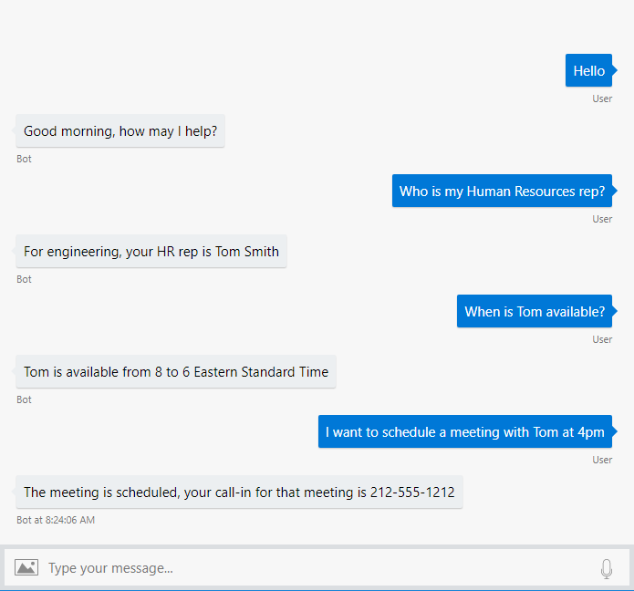

# luis意图识别 - 概念

## 开发一个LUIS应用

LUIS是基于REST API来预测用户五百字以内表达的意图。LUIS应用典型的消费者是对话型应用，例如聊天机器人或者虚拟现实游戏。

接下来的例子，聊天机器人通过文本与用户交互。一次一个交互。



LUIS 用文本与以训练的模型应用来预测用户全部的意图和任意特定的数据。预测返回JSON数据。

创建一个LUIS app 叫做创建一个模型，客户端使用LUIS应用进行查询。

### 模型开发

None 意图

预定义领域

### 意图需要一些样例表达

### 实体是表达中的一段数据

### 训练模型

### 发布模型

### 测试模型

### 提升性能

### 模式

### 终端查询

### 聊天机器人使用LUIS数据

### 使用API

API分为著作API和终端API。

著作API没有限制，但是不许要有正确的key，在[LUIS](https://docs.microsoft.com/en-us/azure/cognitive-services/LUIS/luis-reference-regions#luis-website)网站[你的账号](https://docs.microsoft.com/en-us/azure/cognitive-services/LUIS/luis-how-to-account-settings)页可以找到他.

著作API看起来像下面这个样子：

```
https://<region>.api.cognitive.microsoft.com/luis/api/v2.0/apps/<appId>/versions/<versionId>/
```

终端API对于每秒和每个月都有限制。

当你开始使用LUIs，使用著作API来作为终端擦寻，上升到1000次查询，你将得到403，月配量超额。你可以创建一个 [subscription key](https://docs.microsoft.com/en-us/azure/cognitive-services/LUIS/azureibizasubscription)然后在发布页与你的应用关联。一个 subscription key 可以在所有 LUIS app上使用，但是可能会影响终端每分钟和每个月的查询配额。

终端API URL看起来像这样：

```
https://<region>.api.cognitive.microsoft.com/luis/v2.0/apps/<appID>?subscription-key=<authoringKey>&verbose=true&timezoneOffset=0&q=I want to be called by my HR rep.
```

著作和终端URL看起来很像，但是著作在api最后有额外的路由 /luis/，Ocp-Apim-Subscription-Key 他对理解key是很重要的，无论你请求著作API还是终端API。

## LUIS key

LUIS用两种key： [著作](https://docs.microsoft.com/en-us/azure/cognitive-services/LUIS/luis-concept-keys#programmatic-key)和[终端](https://docs.microsoft.com/en-us/azure/cognitive-services/LUIS/luis-concept-keys#endpoint-key)

### 著作key

### 终端key

### API 使用 Ocp-Apim-Subscription-Key

### Key 限制

