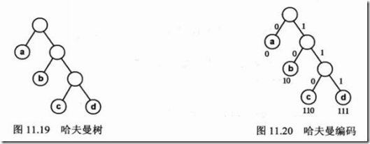

# 哈夫曼树和哈夫曼编码

## 概念

- **节点之间的路径长度** ：在树中从一个结点到另一个结点所经历的分支，构成了这两个结点间的路径上的经过的分支数称为它的路径长度
- **树的路径长度**：从树的根节点到树中每一结点的路径长度之和。在结点数目相同的二叉树中，完全二叉树的路径长度最短。
- **结点的权**：在一些应用中，赋予树中结点的一个有某种意义的实数
- **结点的带权路径长度**：结点到树根之间的路径长度与该结点上权的乘积
- **树的带权路径长度(Weighted Path Length of Tree：WPL)**：定义为树中所有叶子结点的带权路径长度之和

**最优二叉树**：从已给出的目标带权结点(单独的结点) 经过一种方式的组合形成一棵树.使树的权值最小.。最优二叉树是带权路径长度最短的二叉树。根据结点的个数，权值的不同，最优二叉树的形状也各不相同。它们的共同点是：带权值的结点都是叶子结点。权值越小的结点，其到根结点的路径越长。

## 构造哈夫曼树

- 根据给定的n个权值｛w1， w2， w3，...，wn｝构成n棵二叉树的森林 F=｛T1，T2 ，T3，...，Tn｝，其中每棵二叉树只有一个权值为wi 的根节点，其左右子树都为空；

- 在森林F中选择两棵根节点的权值最小的二叉树，作为一棵新的二叉树的左右子树，且令新的二叉树的根节点的权值为其左右子树的权值和；

- 从F中删除被选中的那两棵子树，并且把构成的新的二叉树加到F森林中；

- 重复2 ，3 操作，直到森林只含有一棵二叉树为止，此时得到的这棵二叉树就是哈夫曼树。

## 哈夫曼编码

根据哈夫曼树可以解决报文编码的问题。假设需要把一个字符串，如“abcdabcaba”进行编码，将它转换为唯一的二进制码，但是要求转换出来的二进制码的长度最小。

假设每个字符在字符串中出现频率为W，其编码长度为L，编码字符n个，则编码后二进制码的总长度为W1L1+W2L2+…+WnLn，这恰好是哈夫曼树的处理原则。因此可以采用哈夫曼树的构造原理进行二进制编码，从而使得电文长度最短。

对于“abcdabcaba”，共有a、b、c、d4个字符，出现次数分别为4、3、2、1,相当于它们的权值，将a、b、c、d以出现次数为权值构造哈夫曼树，得到下左图的结果。

从哈夫曼树根节点开始，对左子树分配代码“0”，对右子树分配“1”，一直到达叶子节点。然后，将从树根沿着每条路径到达叶子节点的代码排列起来，便得到每个叶子节点的哈夫曼编码，如下图。

从图中可以看出，a、b、c、d对应的编码分别为0、10、110、111，然后将字符串“abcdabcaba”转换为对应的二进制码就是0101101110101100100，长度仅为19。这也就是最短二进制编码，也称为哈夫曼编码。

## 参考资料

- [1] [哈夫曼树和哈夫曼编码](https://blog.csdn.net/bruce_6/article/details/38656413)